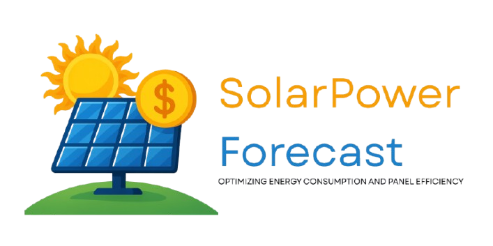

# 🌞 Prévisionniste d'Énergie Solaire & Estimateur d'Économies

Ce projet met en œuvre un pipeline de Machine Learning de bout en bout pour fournir une application web interactive qui estime les économies financières réalisables grâce à une installation de panneaux solaires.

À partir de données historiques, nous modélisons la production d'énergie solaire, la consommation électrique et le coût de l'électricité pour fournir une simulation financière personnalisée à l'utilisateur.


*(Remplacez cette bannière par une capture d'écran ou un GIF de votre application Streamlit)*

---

## ✨ Fonctionnalités Clés

* **Modélisation Hybride :** Utilisation d'un modèle **LSTM avec Attention** pour la prévision complexe de la génération solaire et de modèles statistiques **SARIMA** pour la consommation et les coûts saisonniers.
* **Pipeline de Données Complet :** Scripts pour le traitement des données brutes, l'entraînement des modèles et l'inférence en temps réel.
* **Simulation Financière Dynamique :** Calcule un bilan énergétique horaire (autoconsommation, importation, exportation) pour estimer les économies avec précision.
* **Interface Interactive :** Une application **Streamlit** permet de configurer un système solaire virtuel et de visualiser instantanément l'impact financier.
* **Optimisation d'Hyperparamètres :** Intégration d'**Optuna** pour la recherche systématique des meilleurs paramètres pour le modèle LSTM.

## 🛠️ Technologies Utilisées

* **Langage :** Python 3.9+
* **Analyse de Données :** Pandas, NumPy
* **Apprentissage Profond :** PyTorch
* **Modélisation Statistique :** Statsmodels, Scikit-learn
* **Simulation Photovoltaïque :** PVLib
* **Application Web :** Streamlit
* **Visualisation :** Plotly, Matplotlib

---

## 🚀 Installation et Lancement

Ce guide vous expliquera comment configurer l'environnement, préparer les données, entraîner les modèles et exécuter l'application.

### 1. Prérequis

* **Git** : Nécessaire pour cloner le dépôt. [git-scm.com](https://git-scm.com/)
* **Python** : Version 3.9 ou plus récente. [python.org](https://www.python.org/)

### 2. Configuration de l'Environnement et Installation

#### a. Cloner le Dépôt

```bash
git clone https://github.com/Nawfel-9/solar_forecasting_project
cd solar_forecasting_project
```

#### b. Créer et Activer un Environnement Virtuel

Il est fortement recommandé d'utiliser un environnement virtuel pour isoler les dépendances du projet.

Créez l'environnement (par exemple, nommé `venv`) :

```bash
python -m venv venv
```

Activez ensuite l'environnement :

- Sur **Windows** :

```bash
venv\Scripts\activate
```

- Sur **Linux/macOS** :

```bash
source venv/bin/activate
```

*Note : Si vous utilisez Conda :*

```bash
conda create -n solar_env python=3.9 -y
conda activate solar_env
```

#### c. Installer les Dépendances

Une fois l'environnement activé, installez les bibliothèques requises :

```bash
pip install -r requirements.txt
```

### 3. Préparation et Entraînement (Optionnel)

Suivez cette section uniquement si vous souhaitez recréer les modèles à partir des données brutes. Sinon, passez directement à l'étape 4.

#### a. Télécharger les Données Brutes

Téléchargez l'ensemble de données depuis Kaggle : **Solar Power Generation and Consumption Dataset**. 

Placez les fichiers extraits dans un répertoire `data/` à la racine du projet.

#### b. Exécuter les Scripts de Prétraitement

Assurez-vous que les chemins de fichiers dans `config.yaml` sont corrects.

Exécutez les scripts suivants :

```bash
python consumed_cost_energy_data.py
python generated_energy_estimation.py
```

#### c. Entraîner les Modèles

Entraînez les modèles avec :

```bash
# Entraînement des modèles SARIMA (rapide)
python train/train_sarima.py

# Entraînement du modèle LSTM (plus long)
# Assurez-vous que 'run_optuna_search' est à 'false' dans config.yaml
python train/train_lstm.py
```
*Note: L'entrainement de SARIMA est necessaire par contre lstm a deja un checkpoint.*

### 4. Lancer l'Application Streamlit

Lancez l'application avec :

```bash
streamlit run app.py
```

*Si la commande streamlit n'est pas reconnue :*

```bash
python -m streamlit run app.py
```

L'application s'ouvrira automatiquement sur [http://localhost:8501](http://localhost:8501).

### 5. Arrêter l'Application

Dans le terminal, appuyez sur `Ctrl+C` pour arrêter le serveur Streamlit.

---

## 📂 Structure du Projet

```text
.
├── data/                          # Données brutes et prétraitées
├── models/                        # Définitions des modèles et checkpoints
├── notebook/                      # Notebook contenant la recherche faite
├── train/                         # Scripts d'entraînement
├── utils/                         # Fonctions utilitaires (prétraitement, visualisation, etc.)
├── app.py                         # Application Streamlit principale
├── config.yaml                    # Configuration globale
├── requirements.txt               # Liste des dépendances
├── consumed_cost_energy_data.py   # Produit energy_consumed.csv...
├── generated_energy_estimation.py # Produit energy_generated.csv...
└── README.md                      # Ce fichier