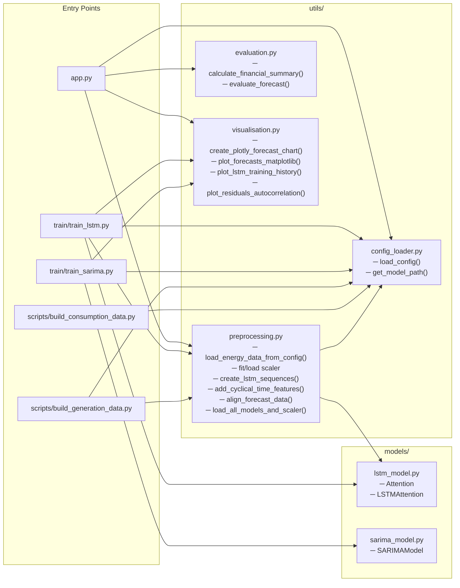
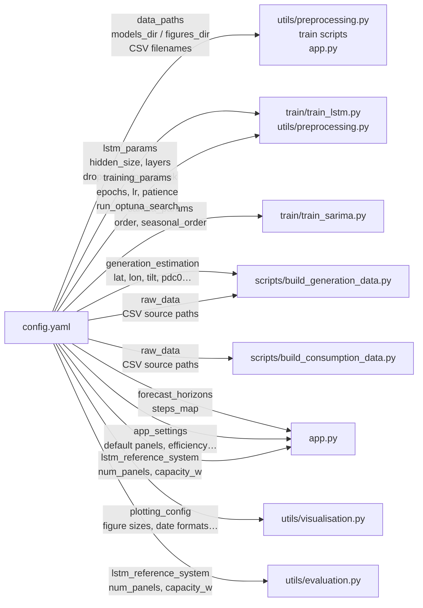

**Navigation:** [README](../README.md) · [Data Pipeline](data_pipeline.md) · [Models](models.md) · [Inference Pipeline](inference_pipeline.md)

---

# System Architecture

## High-Level Overview

The project is organized into four independent stages that form a one-way pipeline: raw data in, trained models out, then a Streamlit app that uses those models at runtime.

```mermaid
graph TD
    subgraph RAW ["Raw Data (not committed)"]
        R1[generated_2009_2023.csv\nHourly irradiance & weather]
        R2[Electric_Consumption_And_Cost…csv\nMonthly utility billing]
    end

    subgraph SCRIPTS ["scripts/ — Data Preparation"]
        S1[build_generation_data.py\nPVLib physics model]
        S2[build_consumption_data.py\nMonthly → weekly disaggregation]
    end

    subgraph PREPROCESSED ["data/preprocessed/ (committed)"]
        P1[energy_generated.csv\nHourly power + time features]
        P2[energy_consumed.csv\nWeekly kWh]
        P3[energy_cost.csv\nWeekly $]
    end

    subgraph TRAIN ["train/ — Model Training"]
        T1[train_lstm.py\nLSTM + Attention]
        T2[train_sarima.py\nSARIMA × 2]
    end

    subgraph ARTIFACTS ["models/artifacts/ (committed)"]
        A1[lstm_solar_generator.pth]
        A2[lstm_scaler.pkl]
        A3[sarima_cost_model.pkl]
        A4[sarima_consumed_model.pkl]
    end

    subgraph APP ["app.py — Streamlit UI"]
        APP1[Load models once per session]
        APP2[Forecast on demand]
        APP3[Financial simulation]
        APP4[Interactive charts]
    end

    R1 --> S1 --> P1
    R2 --> S2 --> P2
    S2 --> P3
    P1 --> T1 --> A1
    T1 --> A2
    P2 --> T2 --> A3
    P3 --> T2 --> A4
    A1 & A2 & A3 & A4 --> APP1
    P1 & P2 & P3 --> APP2
    APP1 --> APP2 --> APP3 --> APP4
```

---

## Module Map

---

## Config-Driven Design

Every behaviour is centralised in `config.yaml` — no constants are scattered in source files.

---

## Key Design Decisions

| Decision | Rationale |
|---|---|
| `app.py` at repo root | Streamlit requires `streamlit run app.py` from the root; nesting it would break the command |
| `@st.cache_resource` on model loader | Models are large — cache them in the Streamlit session instead of reloading on every interaction |
| LSTM trained on a reference system; user systems scaled at runtime | Allows arbitrary system sizing without retraining — a simple linear scaling proportional to total kWp |
| Preprocessed CSVs committed | Raw data (~14 MB) is private/external; preprocessed outputs are small enough to commit, enabling zero-setup app usage |
| SARIMA not committed | Fitted statsmodels results are large and environment-specific; they must be re-trained locally in ~minutes |
| Cyclical time features (sin/cos) | Avoids the discontinuity at hour 23 → 0 and day 365 → 1 that integer hour/day encodings introduce |
