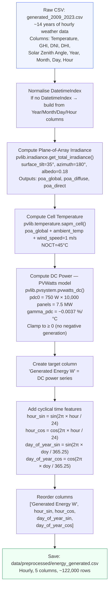
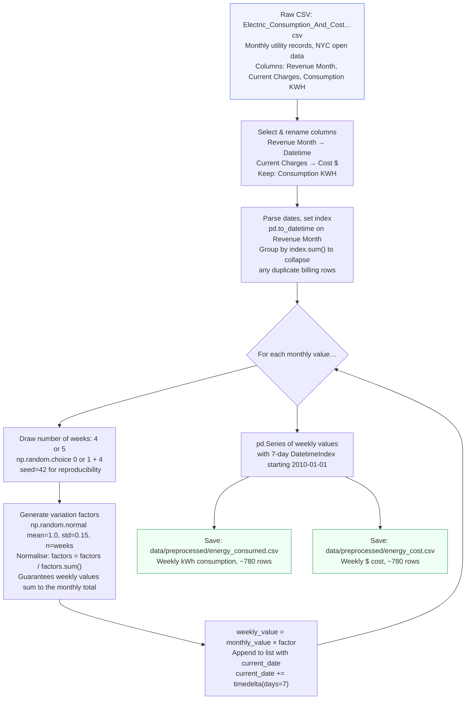
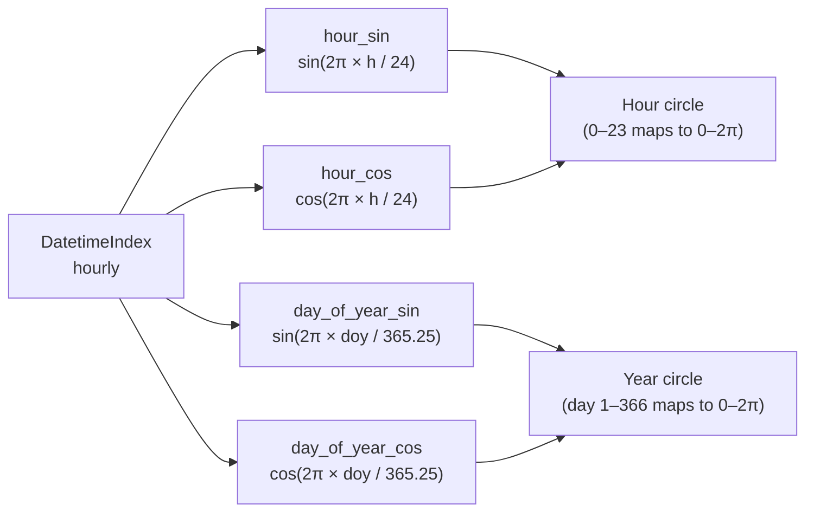

**Navigation:** [README](../README.md) · [Architecture](architecture.md) · [Models](models.md) · [Inference Pipeline](inference_pipeline.md)

---

# Data Pipeline

## Overview

There are two independent data pipelines — one for solar generation and one for electricity
consumption/cost. Both run through dedicated scripts and produce the preprocessed CSVs that
the training and app code consumes.

---

## Generation Pipeline

Converts raw meteorological data into a multi-feature hourly DataFrame suitable for the LSTM.

**Why cyclical encoding?** A plain integer hour column jumps from 23 → 0 at midnight —
a large discontinuity that looks like a meaningful signal to the model. Sine/cosine pairs
encode hour as a smooth circle: hour 23 and hour 0 are neighbours in the encoding space.

---

## Consumption & Cost Pipeline

Disaggregates monthly utility billing records into synthetic weekly data.

**Why disaggregate to weekly?** SARIMA requires a consistent frequency. Monthly data has only
~180 points (2010–2025), which is marginal for a seasonal ARIMA with `s=12`. Expanding to
~780 weekly points with `s=52` provides a much richer training set.

---

## Feature Engineering Detail

`add_cyclical_time_features()` in `utils/preprocessing.py` — called by both the generation
script (to build the training CSV) and by the LSTM inference loop (to generate features for
future time steps on the fly).

---

## Train/Validation/Test Split

Applied inside the training scripts using `prepare_train_test()` from `utils/preprocessing.py`.

```mermaid
gantt
    title Dataset splits (proportional, not to scale)
    dateFormat X
    axisFormat %s

    section Generation data (hourly)
    Training set (68%)   : 0, 68
    Validation set (12%) : 68, 80
    Test set (20%)       : 80, 100

    section Cost & Consumption (weekly)
    Full series used for SARIMA training : 0, 100
```

- `test_size = 0.20` (config: `preprocessing.test_size`)
- `validation_size_from_train = 0.15` (config: `preprocessing.validation_size_from_train`)
- SARIMA trains on the full series (there is no held-out test split at training time — forecasts
  are by definition out-of-sample since they extend beyond the end of the data).

---

## Scaler

A `StandardScaler` (zero mean, unit variance) is fit on the **training portion only** of the
`Generated Energy (W)` target column, then saved to `models/artifacts/lstm_scaler.pkl`.

At inference time the same scaler is used to:
1. Scale the last 168-hour context window before feeding it to the LSTM
2. Inverse-transform the LSTM's scaled predictions back to watts

The four time-feature columns (`hour_sin`, `hour_cos`, `day_of_year_sin`, `day_of_year_cos`)
are already in `[-1, 1]` by construction and are **not scaled**.
