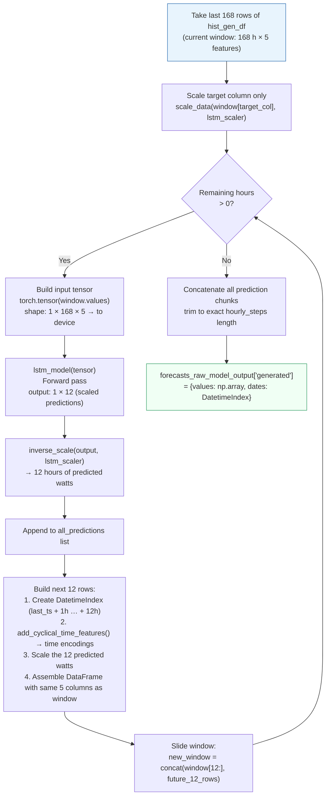
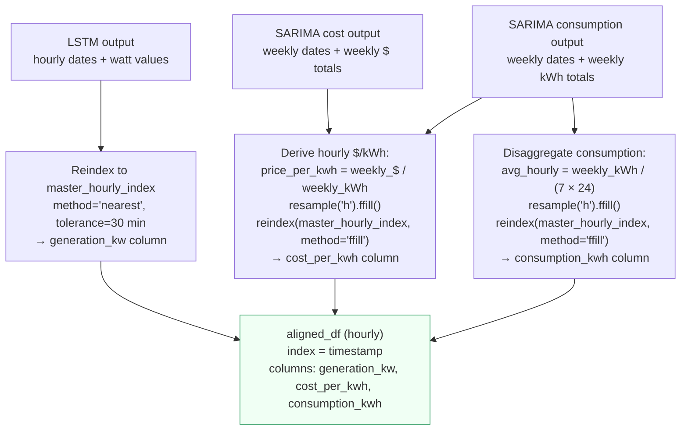
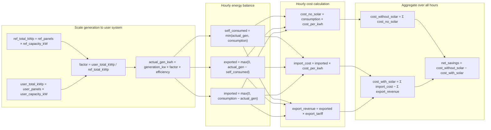
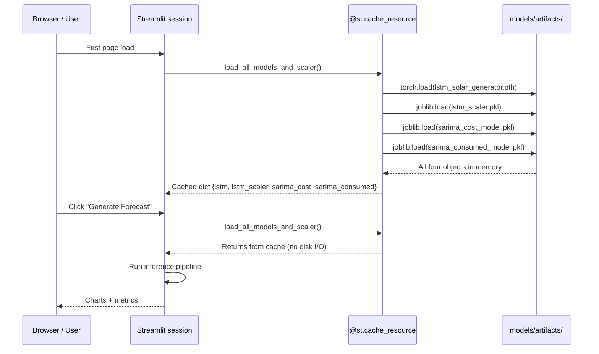

**Navigation:** [README](../README.md) · [Architecture](architecture.md) · [Data Pipeline](data_pipeline.md) · [Models](models.md)

---

# Inference Pipeline

This document traces exactly what happens from the moment the user clicks **"Generate Forecast
& Estimate Savings"** in the Streamlit app to the charts and financial metrics on screen.

---

## End-to-End Flow

```mermaid
flowchart TD
    CLICK["User clicks\nGenerate Forecast & Estimate Savings"]

    CLICK --> LOAD_DATA["1 · Load historical data\nload_energy_data_from_config()\n\n→ hist_cost (weekly Series)\n→ hist_consumed (weekly Series)\n→ hist_gen_df (hourly DataFrame, 5 cols)"]

    LOAD_DATA --> RESOLVE_STEPS["2 · Resolve forecast horizon\nget_steps_from_config(selected_horizon_key)\n\nExample — '1 Month':\n  hourly_steps = 720\n  weekly_steps_sarima = 4"]

    RESOLVE_STEPS --> LSTM_LOOP["3 · LSTM iterative forecast\nSee detail below"]

    LSTM_LOOP --> SARIMA_FORECAST["4 · SARIMA forecasts\nsarima_cost_model.forecast(steps=4)\nsarima_consumed_model.forecast(steps=4)\n\n→ fc_cost_mean, fc_cost_ci\n→ fc_cons_mean, fc_cons_ci"]

    SARIMA_FORECAST --> ALIGN["5 · Align to hourly index\nalign_forecast_data()\n\nGeneration: reindex hourly forecast to master index\nCost: derive $/kWh = weekly_$ / weekly_kWh → ffill to hourly\nConsumption: weekly_kWh / (7×24) → average hourly → ffill\n\n→ aligned_df columns: generation_kw, cost_per_kwh, consumption_kwh"]

    ALIGN --> FINANCIAL["6 · Financial simulation\ncalculate_financial_summary()\n\nSee financial detail below"]

    FINANCIAL --> SCALE_HIST["7 · Scale historical generation\nfor plotting only\nscaled_hist = hist_gen × (user_kWp / ref_kWp)"]

    SCALE_HIST --> CHARTS["8 · Render charts\nPlotly: create_plotly_forecast_chart()\nMatplotlib: plot_forecasts_matplotlib()\n\n3 subplots: generation, cost, consumption"]

    CHARTS --> METRICS["9 · Display KPI metrics\n─ Total energy generated (kWh)\n─ Total energy consumed (kWh)\n─ Avg import price ($/kWh)\n─ Gross value of solar ($)"]

    style CLICK fill:#fff9c4,stroke:#d69e2e
    style METRICS fill:#f0fff4,stroke:#38a169
    style LSTM_LOOP fill:#e8f4fd,stroke:#2b6cb0
    style FINANCIAL fill:#fce8e6,stroke:#c53030
```

---

## Step 3 Detail — LSTM Iterative Loop

---

## Step 5 Detail — Frequency Alignment

SARIMA forecasts are weekly; LSTM forecasts are hourly. The app needs a single hourly DataFrame.

---

## Step 6 Detail — Financial Simulation (hourly)

---

## Model Loading & Caching

Models are loaded once per browser session via `@st.cache_resource` and reused on every
"Generate Forecast" click. This avoids re-deserialising the ~50 MB PyTorch checkpoint on
every interaction.

Cache TTL is set by `caching.model_ttl_seconds` in `config.yaml` (default: 3600 s).
