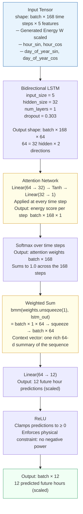
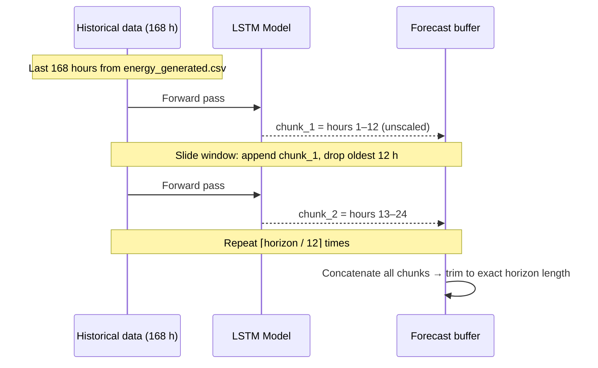
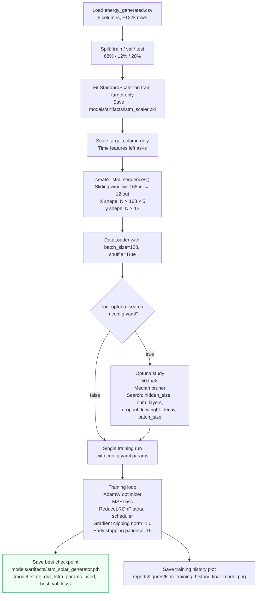
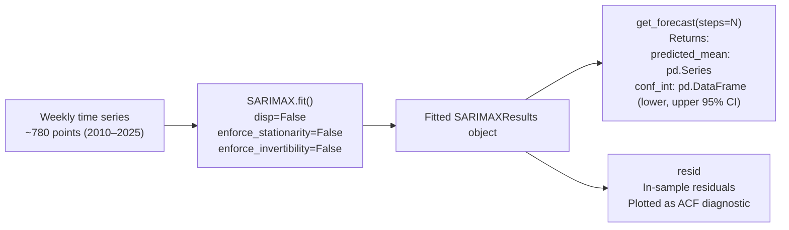
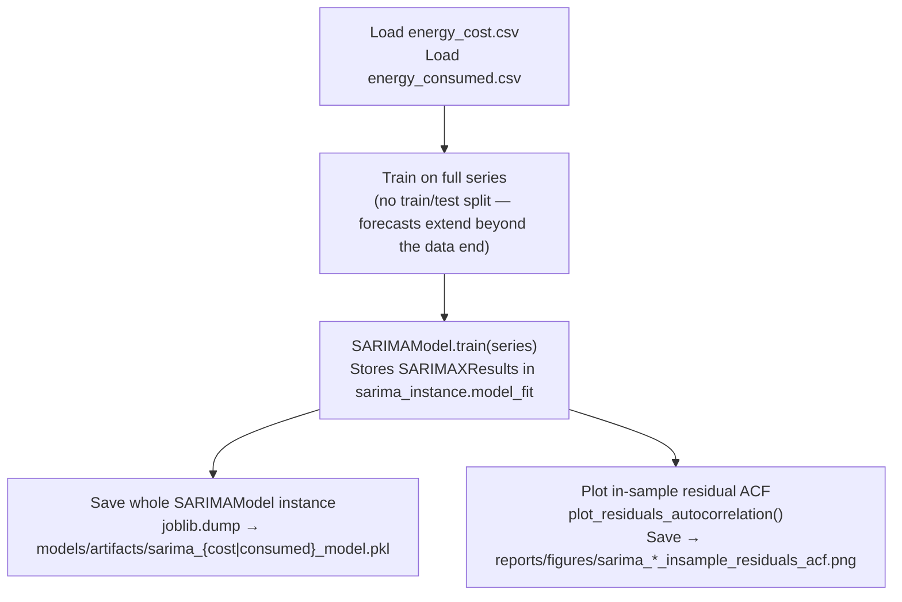
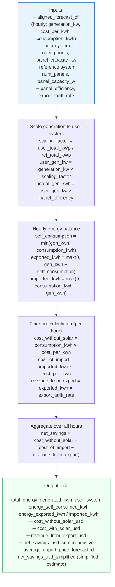

**Navigation:** [README](../README.md) · [Architecture](architecture.md) · [Data Pipeline](data_pipeline.md) · [Inference Pipeline](inference_pipeline.md)

---

# Models

## 1. LSTM with Attention — Solar Generation Forecasting

### Purpose

Predicts hourly solar DC power output (W) for the next N hours, given the last 168 hours of
historical generation and cyclical time features.  Uses a **direct multi-step** strategy:
the model outputs a chunk of 12 future hours in a single forward pass, then slides forward
iteratively to cover the full forecast horizon.

### Architecture (`models/lstm_model.py`)



### Why Attention?

A plain LSTM compresses the entire 168-step sequence into a single hidden state. Attention lets
the model **look back** at all 168 outputs simultaneously and learn which time steps matter most
for the current prediction — for example, the same hour yesterday, or sunrise yesterday relative
to today's forecast window.

### Direct Multi-Step Forecasting Strategy

Instead of predicting one hour and feeding it back (recursive / autoregressive), the model
predicts a **chunk of 12 hours at once**. This avoids error accumulation across many auto-
regressive steps but requires re-running the model iteratively to cover a longer horizon.



**At each step:**
1. Inverse-scale the 12 predicted values (watts) for downstream use
2. Re-scale them back to feed as the target column of the next context window
3. Generate new `hour_sin/cos`, `day_of_year_sin/cos` for the future timestamps via
   `add_cyclical_time_features()` — these are computed from timestamps, not predicted

### Training (`train/train_lstm.py`)



---

## 2. SARIMA — Cost & Consumption Forecasting

### Purpose

Generates multi-week forecasts of electricity cost ($/week) and consumption (kWh/week) with
confidence intervals.  The weekly SARIMA forecasts are later disaggregated to hourly resolution
by the alignment step in the app.

### Model (`models/sarima_model.py`)

A thin wrapper around `statsmodels.tsa.statespace.SARIMAX`.

```
SARIMA(p, d, q)(P, D, Q, s)

Cost model:        SARIMA(1,1,1)(1,1,0,52)
Consumption model: SARIMA(1,1,1)(1,1,0,52)

p=1: one autoregressive term
d=1: first-order non-seasonal differencing (makes series stationary)
q=1: one moving-average term
P=1: seasonal AR term
D=1: seasonal differencing
Q=0: no seasonal MA term
s=52: seasonal period = 52 weeks (annual cycle)
```



### Training (`train/train_sarima.py`)



**Why save the whole instance instead of just `model_fit`?**  
The `SARIMAModel` wrapper stores the orders (`order`, `seasonal_order`) alongside the fitted
results.  Saving the whole object means you get those metadata fields back on load without
needing to re-read config.

---

## 3. Financial Evaluation (`utils/evaluation.py`)

Not a predictive model, but a deterministic simulation layer that sits on top of the two
forecasting models.


